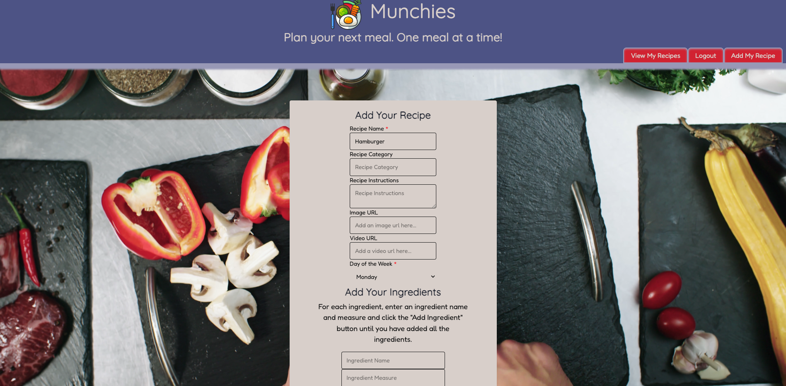

# Munchies: A Meal Planner

## Description

Munchies is a meal planning application that lets you search for recipes from an external API and allows you to organize weekly day by day when you will use this recipe.

If you have your own recipes, no worries. Our app allows you to save your own recipes and organize them in your weekly plan! 

## Table of Contents

- [Usage](#usage)
- [Future Plans](#future-plans)
- [Credits](#credits)
- [Resources](#resources)
- [License](#license)
- [Questions](#questions)

## Usage

Upon navigating to the webpage, you will see this home page.

***Note: Clicking on the Munchies logo at anytime throughout the website will take you back to the home page.***

The home page will let you search for recipes, but you can't save the recipe unless you create an account and log in.

To login in, click the "Login" button in the header or click the button under each recipe card to navigate to the Login page. Once at the Login page you'll see this screen, where you can login if you already have an account or select the "Register" button in the navbar to create an account.

If you need to register, you'll just need to enter you name, email, and a password to create an account.

Once you have an account and are logged in, you can then search and save recipes to days of the week. A search will return cards populated with the different recipes. Clicking on a card will show the recipe's details, image, and a video to watch about the recipe if one exists for that recipe. There is also an option to print the recipe above the recipe image that will open a print window, making it easy to print your recipe when you're cooking it up!

To save the recipe to your plan, click on the "Choose a Day to Save" dropdown and select the day you would like to save the recipe for. This selection will cause the recipe to save to that day. 

Saved recipes can viewed by clicking on the "View My Recipes" button in the navbar to navigate to the recipe page. Here, you can view the recipes you've saved, open the detailed information page about the recipe to read, print, or watch a video for that recipe, or delete it if you no longer need it and don't want it on that day. 

If you were unable to find the recipe you wanted in the search, or want to add your favorite dish from mom, click on "Add My Recipe" to navigate to the add-your-own-recipe page. Here, You'll need to enter at least name and day for your recipe. Ingredients can be added by entering an ingredient name and measurement and selecting "Add". A preview is available at the bottom of the form so you can verify that your recipe and its ingredients are correct, and you will also have the option to remove an ingredient if you made a mistake. If everything looks right, click on "Add this Recipe" to save it to the selected day. This will save the recipe to the selected day. If a video url or image url was added, those will display as well. The recipe can also be printed.

That's most of our current features! Feel free to explore the application and as always, make sure to report any bugs to the [contributors](#questions) listed below!

## Future Plans

A few things to get excited about! 
- A grocery list so you can keep track of the ingredients you need to buy to make the meals for the week.
- Display the calories for each ingredient.
- A "cookbook" page so that recipes can be savedwithout being associated to a day of the week for easy future reference and week plans.
- A like button and an associated page.
- Storage for multiple weeks of recipes so that users can plan out up to a month in advance if desired.

## Credits

Collaborators
- John Goldade: Database & Front-End 
- Jacob Peterson: API Queries & Styling
- Ivelis Becker: Project Manager, Deployment, & Front-End
- Brett Lintgen: Deployment , Database Queries, & Front-End

## Resources

- [Figma](www.figma.com/) for designing & planning the website
- [The Meal DataBase](https://www.themealdb.com/api.php) for recipes
- [GitHub](https://github.com/) for the project repository
- [Render](https://render.com/) for the project server
- [Tailwind](https://tailwindcss.com/) for project styling
- [Creative Tim](https://www.creative-tim.com/) for some Tailwind components
- [Envato](https://elements.envato.com/) & [Pexels](http://www.pexels.com) for the video backgrounds

## License

Licensed under the [MIT](./LICENSE) license.

## Questions
For questions contact project lead Ivelis Becker at her [email](ivelisbecker@gmail.com) or [GitHub](https://github.com/I-0110)

or our contributors:
- Jacob Peterson @ [GitHub](https://github.com/Jpeterson1118)
- John Goldade @ [GitHub](https://github.com/Johngoldade)
- Brett Lintgen @ [GitHub](https://github.com/blintgen)
